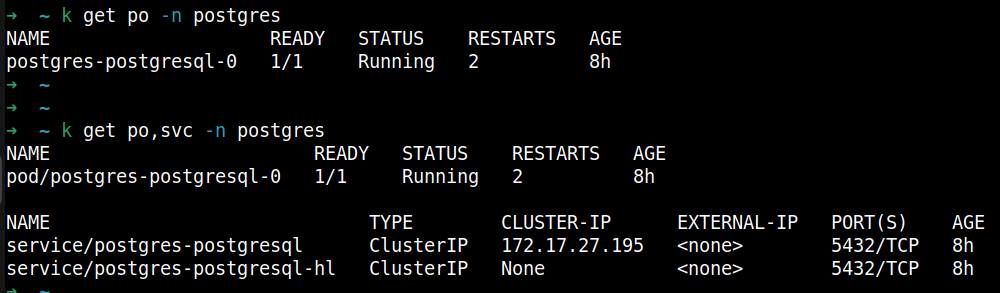
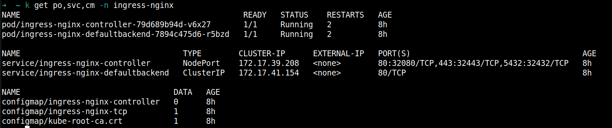
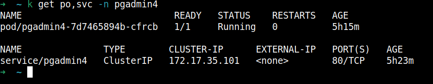
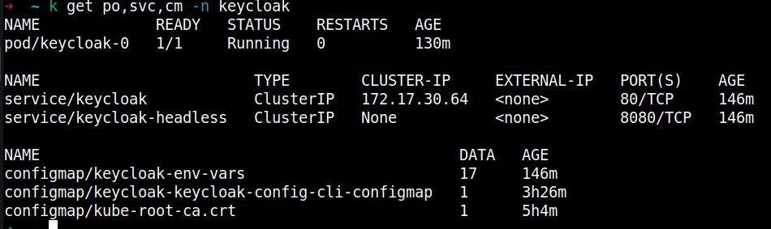
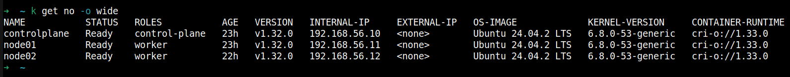
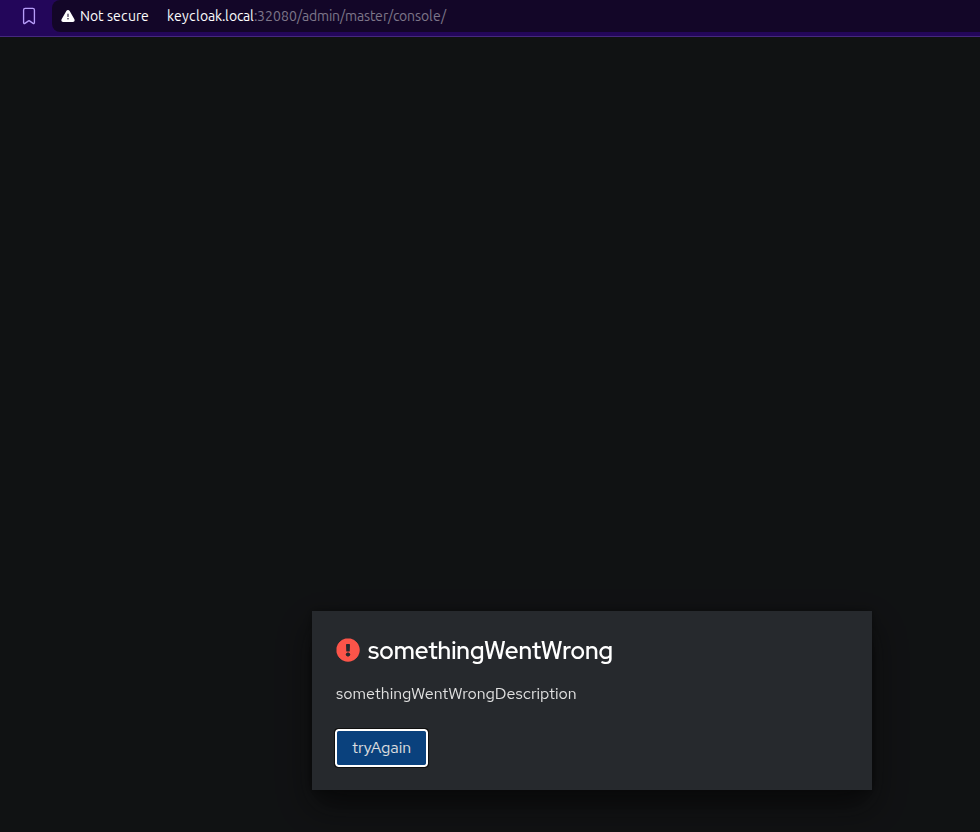
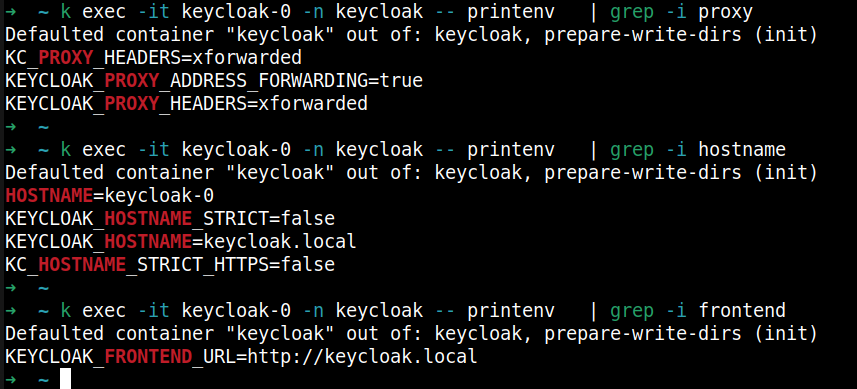

# Kubernetes Deployment with Helm: PostgreSQL, Nginx Ingress, pgAdmin, and Keycloak

This guide walks you through deploying **PostgreSQL**,**Nginx Ingress**, **pgAdmin**, and **Keycloak** in a Kubernetes cluster using Helm with custom `values.yaml` configuration files.

---

## Prerequisites

- A running Kubernetes cluster (`kind` or `VM using kubeadm`)
- `kubectl` configured to access your cluster
- [Helm 3.x](https://helm.sh/docs/intro/install/)
- Custom `values.yaml` files:
  - `postgres-values.yaml`
  - `nginx-ingress-values.yaml`
  - `pgadmin-values.yaml`
  - `keycloak-values.yaml`
---

## Step 1: Add Helm Repositories

```bash
helm repo add bitnami https://charts.bitnami.com/bitnami
helm repo add ingress-nginx https://kubernetes.github.io/ingress-nginx
helm repo add runix https://helm.runix.net
helm repo update
```

## Step 2: Install PostgreSQL

```bash
helm upgrade --install postgres bitnami/postgresql -f postgres-values.yaml --namespace postgres --create-namespace

# Check PGSQL Pod is running
k get po,svc -n postgres
```


## Step 3: Install Nginx Ingress

```bash
helm upgrade --install ingress-nginx ingress-nginx/ingress-nginx -f nginx-ingress-values.yaml --set tcp.5432="postgres/postgresql:5432" --namespace ingress-nginx --create-namespace

# Check Nginx Ingress Pod is running
k get po,svc,cm -n ingress-nginx
```


## Step 4: Install pgAdmin

```bash
helm upgrade --install pgadmin4 runix/pgadmin4 -f pgadmin-values.yaml --namespace pgadmin4 --create-namespace

# Check pgAdmin Pod is running
k get po,svc -n pgadmin4
```


## Step 5: Install Keycloak

```bash
helm upgrade --install keycloak bitnami/keycloak -f keycloak-values.yaml --namespace keycloak --create-namespace

# Check Keycloak Pod is running
k get po,svc,cm -n keycloak
```


<details>

<summary>⚠️ Notes and Attention (click to expand)</summary>

- ✅ **My set-up is 3 Virtual nodes using vagrant**: Check [this](https://github.com/techiescamp/vagrant-kubeadm-kubernetes/tree/main)



- ✅ **Pass TCP port to Nginx Ingress during installation**: Nginx Ingress Chart does not respect tcp port in values file
(read [this](https://github.com/kubernetes/ingress-nginx/blob/main/docs/user-guide/exposing-tcp-udp-services.md) and [this](https://github.com/kubernetes/ingress-nginx/blob/main/charts/ingress-nginx/values.yaml#L1218))

```bash
tcp:
  "5432": "<postgres-namespace>/<postgres-service>:5432"
```

Error you will get if you define tcp block in values.yaml file

```bash
Error: INSTALLATION FAILED: 3 errors occurred:
* ConfigMap in version "v1" cannot be handled as a ConfigMap: json: cannot unmarshal object into Go struct field ConfigMap.data of type string
* Service in version "v1" cannot be handled as a Service: json: cannot unmarshal string into Go struct field ServicePort.spec.ports.port of type int32
* Deployment in version "v1" cannot be handled as a Deployment: json: cannot unmarshal string into Go struct field ContainerPort.spec.template.spec.containers.ports.containerPort of type int32
```
- ✅ **Keycloak throws Error**: Keycloak Bitnami Chart (read [this](https://github.com/keycloak/keycloak/issues/33330) and [this](https://github.com/keycloak/keycloak/issues/30471))



I have added all the respective headers. Not sure what is missing.



- ✅ **Kind Cluster**: If you're using Kind Cluster then you can use Metallb to expose your Nginx Ingress. (Check [this](https://metallb.universe.tf/installation/#installation-with-helm)). It comes up with its own complexity.

- ✅ **pgAdmin Ingress issue**: Nginx Ingress does not respect proper redirect for `/pgamin4` when you use NodePort for Nginx Ingress. \
Hit `http://<nginx-ingress-node-ip>:32080/pgadmin4` \
Upon entering logging details it redirects back to `http://<nginx-ingress-node-ip>/pgadmin4`. Port is missing. Try to add the port and it works. \
Also tried to add PGSQL DB details via pgadmin-values.yaml in `server` block (read [this](https://github.com/rowanruseler/helm-charts/blob/main/charts/pgadmin4/values.yaml#L100)) but it failed.

- ✅ **Secret Management**: Secrets can be managed via External Secrets Operator (for AWS).

</details>